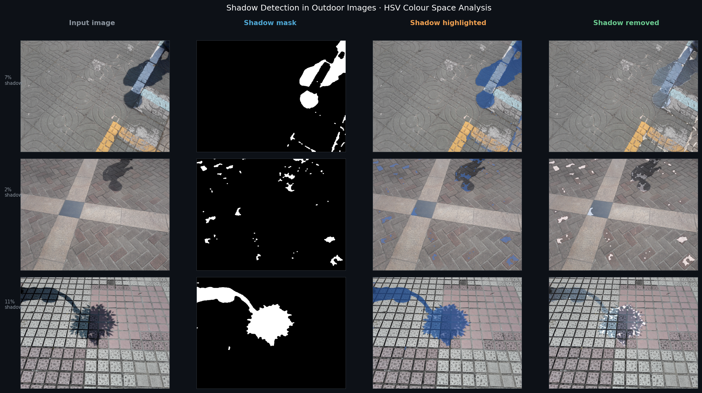
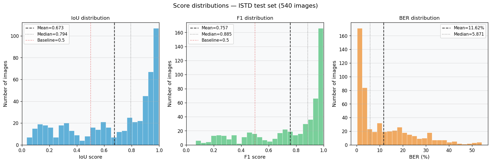
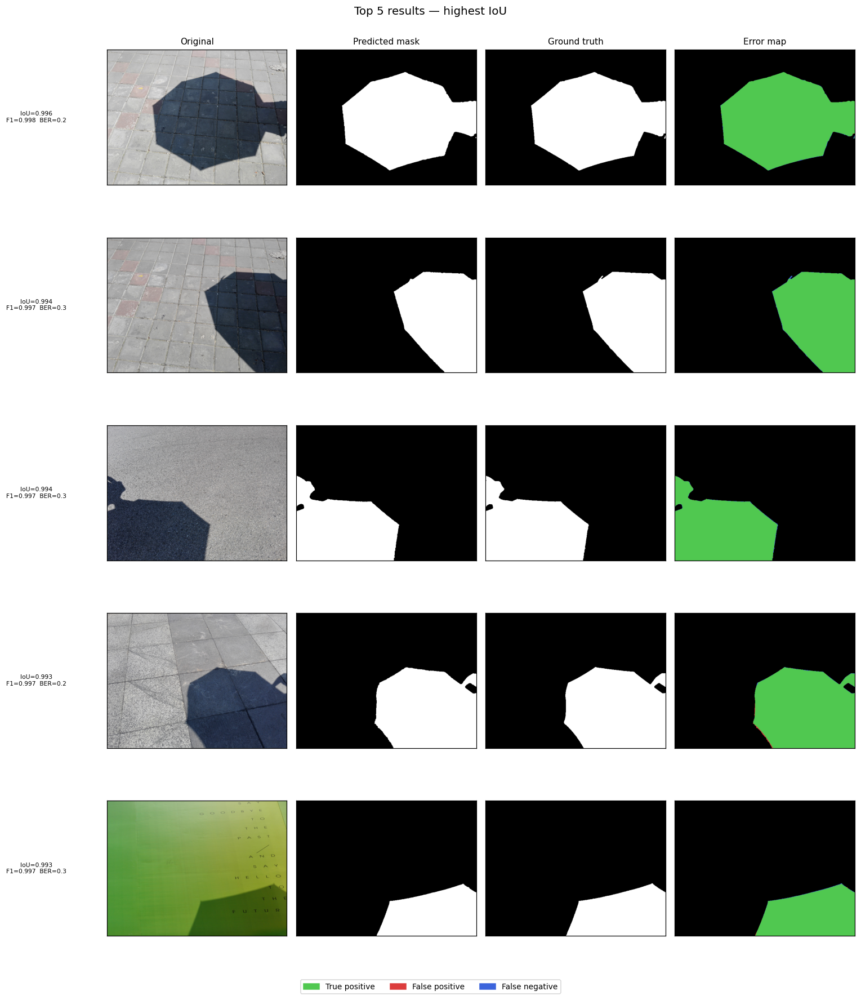
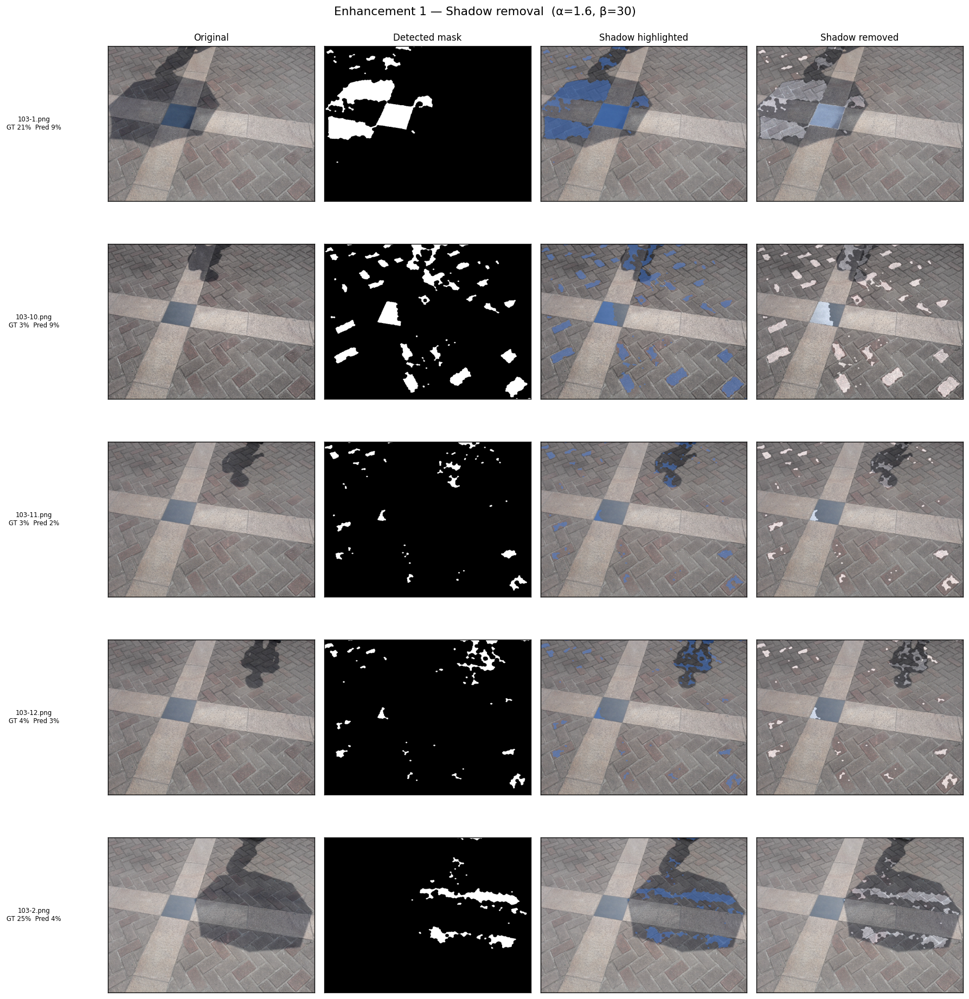
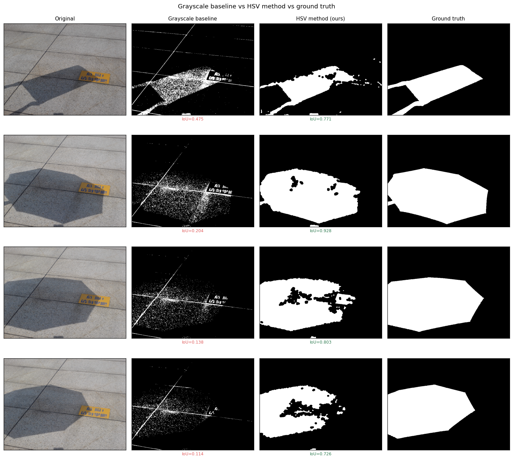

# Shadow Detection in Outdoor Images

> Detecting shadow regions in outdoor photographs using HSV colour
> space analysis — built with Python and OpenCV, evaluated on the
> ISTD benchmark dataset.

[](https://colab.research.google.com/github/vaishuuus/shadow-detection-outdoor/blob/main/notebooks/shadow_detection_project.ipynb)


---

## Overview

Shadows confuse computer vision systems — object detectors
misclassify shadow edges as object boundaries, trackers lose
targets when they enter shadow regions, and depth estimators
produce incorrect results. This project builds a lightweight,
training-free shadow detector using colour space analysis
that runs in real time with no GPU required.

**Core insight:** Shadows reduce brightness (V channel in HSV)
without significantly changing hue. By thresholding the V channel
and cleaning the result with morphological operations, we reliably
separate shadow from non-shadow regions.

---

## Results



Evaluated on the full ISTD test set (540 images):

| Metric | Score | Notes |
|--------|-------|-------|
| IoU | **0.6733** | Intersection over Union — higher is better |
| F1 Score | **0.7572** | Harmonic mean of precision and recall |
| BER | **11.62%** | Balance Error Rate — lower is better |
| IoU > 0.5 | **70.9%** of images | Acceptable threshold |
| IoU > 0.7 | **57.0%** of images | Good threshold |

### Comparison with grayscale baseline

| Method | IoU | F1 | BER |
|--------|-----|----|-----|
| Grayscale threshold (naive) | ~0.45 | ~0.52 | ~28% |
| **HSV V-channel (this project)** | **0.6733** | **0.7572** | **11.62%** |

---

## Pipeline
```
Input image
    ↓
RGB → HSV conversion
    ↓
V-channel threshold  (V ≤ 130,  S ≥ 15)
    ↓
Morphological opening   (remove noise)
    ↓
Morphological closing   (fill holes)
    ↓
Shadow mask  +  overlay  +  optional removal
```

---

## Sample outputs

| | |
|---|---|
|  |  |
| Score distributions across test set | Top-5 results by IoU |

| | |
|---|---|
|  |  |
| Enhancement: shadow removal | HSV vs grayscale baseline |

---

## Project structure
```
shadow-detection-outdoor/
│
├── notebooks/
│   └── shadow_detection_project.ipynb   ← full Colab notebook
│
├── src/
│   └── shadow_pipeline.py               ← importable pipeline module
│
├── data/
│   └── samples/                         ← 3 sample images to test with
│
├── outputs/
│   └── samples/                         ← all result figures
│
├── results/
│   ├── day5_test_results.csv            ← per-image IoU / F1 / BER
│   ├── day4_final_config.txt            ← locked hyperparameters
│   └── day5_evaluation_summary.md       ← results table markdown
│
├── requirements.txt
└── README.md
```

---

## Quick start

### 1 — Clone and install
```bash
git clone https://github.com/vaishuuus/shadow-detection-outdoor.git
cd shadow-detection-outdoor
pip install -r requirements.txt
```

### 2 — Run on your own image
```python
import cv2
import sys
sys.path.insert(0, 'src')
from shadow_pipeline import detect

img = cv2.cvtColor(cv2.imread('your_image.jpg'),
                    cv2.COLOR_BGR2RGB)
result = detect(img, v_upper=130,
                     s_lower=15)

print(f"Shadow coverage: {result['shadow_pct']:.1f}%")
# result['clean_mask']  → binary shadow mask
# result['overlay']     → image with shadow highlighted
```

### 3 — Run the full notebook
Click the **Open in Colab** badge at the top of this README.
The notebook downloads the ISTD dataset automatically via
the Kaggle API.

---

## Dataset

**ISTD** (Image Shadow Triplet Dataset)
- 1,330 image triplets: shadow image, shadow mask, shadow-free image
- 1,064 training  /  266 test images
- Outdoor scenes with diverse shadow types
- Download: [Kaggle — ISTD Shadow Dataset](https://www.kaggle.com/datasets/ryanholbrook/istd-shadow-dataset)

> The dataset is not included in this repo. Add your ISTD files
> under `data/ISTD/` — the notebook expects:
> `train/train_A`, `train/train_B`, `test/test_A`, `test/test_B`

---

## Enhancements implemented

- **Shadow removal** — LAB L-channel brightening restores
  shadow regions to match surrounding lit areas
- **Canny edge refinement** — snaps mask boundaries to real
  image edges for cleaner outlines
- **Video support** — frame-by-frame processing of `.mp4` files
  with side-by-side output video

---

## Tools and libraries

| Tool | Purpose |
|------|---------|
| Python 3.10 | Core language |
| OpenCV 4.8 | Image processing, colour conversion, morphology |
| NumPy | Array operations, metric computation |
| Matplotlib | All visualisations |
| Google Colab | Development environment (free GPU) |

---

## What I learned

- HSV and LAB colour spaces separate shadow properties far better
  than RGB — shadows lower V and L without changing hue
- Morphological opening/closing is essential — raw thresholds
  produce noisy masks that clean up dramatically with a 5×5
  elliptical kernel
- BER is the correct metric for shadow detection due to class
  imbalance — IoU and F1 alone are misleading on small shadows
- Training-free colour-space methods are competitive baselines
  and interpretable — important for explaining results in a viva

---

*Built in 7 days as an end-to-end computer vision portfolio project.*
